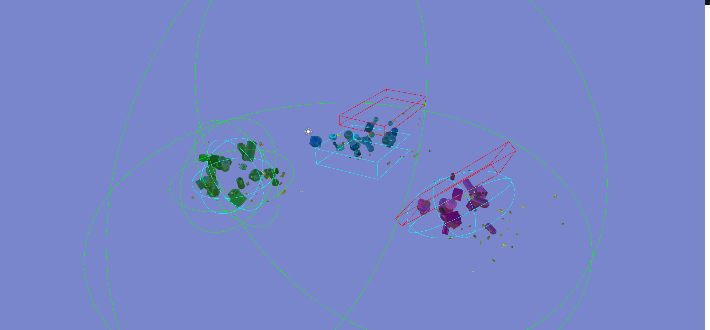

# Spawning-Objects
Project made for fun, based on tutorial from [catlikecoding.com](https://catlikecoding.com/unity/tutorials/object-management/persisting-objects/)

## Features
#### Shapes
Used in variety of ways, Shapes are small objects, that are being created and customized. They are recycled with Object Pooling. 
Currently, upon creation, following properties can be randomized:
- Rotation
- Scale
- Material
- Color

#### Game Systems
Being responsible for all the logic related to Shapes' behaviour, Game Systems are highly performant by using Jobs System with Burst compiler. Each system perform it's own, independent task. Shapes are added to the systems by Spawn or Behaviour Zones.

- Move System - moves Shape in given direction
- Rotation System - rotates Shape by it's angular velocity
- Oscillation System - makes Shape moving back and forth in straight line
- Satellite System - lets a Shape orbit around another Shape 
- Scale System - changes Shape's scale in given duration

#### Spawn Zones
Highly customizable, Spawn Zones are areas where Shapes are spawned. Each spawner can contain multiple Spawn Zones, which can be choosen in many different ways e.g. randomly or based on priority. Each Spawn Zone have set of components, which perform actions on every spawned Shape (creating satelites for instance).

#### Behaviour Zones
Making everything more interesting, Behaviour Zones permorm actions on Shapes that either enters or leaves them.
- Killzone - kills every Shape thas enters it
- Lifezone - keeps Shapes alive as long, as they are inside it
- Color zone - changes Shapes' color
- Velocity zone - changes Shapes' speed and/or movement direction
- Probability zone - used in combination with another zone, which is used or not, based on given probability

## GIFs
A variety of Game Systems and Spawn Zones in use.

More Behaviour Zones in action.

Selective Behaviour Zones.

## License
This project is licensed under the MIT License - see the [LICENSE](LICENSE) file for details.
